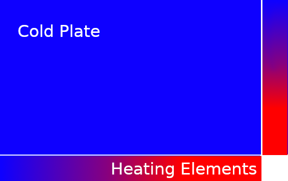
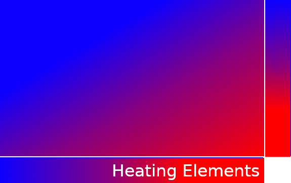

# Threadproj

In this project, we have provided programs that uses two synchronization primitives that need to be implemented in order for the program to execute correctly. These primitives are called reader-writer locks and barriers.

## Barriers
Barriers are a synchronization primitive that causes a set of threads to wait for each other until everyone has reached the barrier. Once each thread in the pool has reached the barrier, they can continue executing along their path.

This is often useful in code scenarios where work within an iteration of a program is being parallelized.
Threads should not continue on to future iterations while other threads are working on past iterations!


### Objectives:
- Gain a deeper understanding of deadlock and resolving it
- Learn about barriers, a common synchronization primitive

### Instructions:
For this project, we provide a test application (more details below),
and the interface for the barrier that the application uses. Barriers
implement two functions: an init function (`barrier_init`) and a wait
function (`barrier_wait`) and have a variety of different
implementations.

A barrier is initialized to expect a certain number of threads. When a
thread reaches a barrier, it 'waits' at the barrier and stops executing
until the specified number of threads are waiting. Then, the threads
leave the barrier and continue execution.
`barrier_init` takes a `barrier_t` struct defined in barrier.h and an
integer corresponding to the number of threads and initializes the
`barrier_t` struct. You are responsible for filling the `barrier_t`
struct with values that allow you to obtain this functionality.

The `barrier_wait` function takes in a `barrier_t` and waits if there
are less than the specified number of threads waiting at the barrier. If
the number of threads waiting matches the specified number, all threads
are released, and the barrier is reset so that it can be used again.

Barriers can encounter a variety of race conditions that can make them
really tricky to implement. We are not exposing your barrier
implementation to back-to-back uses of the same barrier, ie:
```
barrier_wait(&my_barrier);
~some work~
barrier_wait(&my_barrier);
```
Instead, we are using two separate barriers like so:
```
barrier_wait(&my_barrier1);
~some work~
barrier_wait(&my_barrier2);
```
This gives you some more freedom in your implementation and hopefully
makes it a little bit easier.

Your barrier must use `pthread_mutex_t` to stall and wakeup threads.

### Submission

 - Submit your project on gradescope using the gitlab submission
   process.
 - The required files for submission are `barrier.c` and `barrier.h`.

### Barrier Test Program

The program being used to test your barrier implementation is an iterative solver for the heat equation.
The initial setup is a metal plate with two heating elements along the top and right side.
In the beginning, the metal plate is uniformly initialized at 0 degrees celcius, but with the introduction of these heating elements,
the plate is no longer in equilibrium. 



Above is the initial state of our metal plate and heating elements



Once the metal plate forms an  equilibrium with the heating elements, the heat distribution should look something like this.

We break the metal plate into a grid and store the temperature at each point of the
grid in an array. The temperature of each point in the next iteration is the average temperature of a grid point's neighbors
during the previous iteration. After many iterations, we finally reach a new equilibrium and this is our final solution.

The following code snippet is pseudocode for the serial version of the solver, which will be used as ground-truth.
```
for each iteration:
    for each row:
        for each column:
            record the difference average of each grid point's neighbors and the current temperature
            
    for each row:
        for each column:
            update the temperature matrix to store the average previously computed
```

Notice how the second loop depends on data produced in the first loop. How does this affect us when we parallelize?
Let's consider some pseudocode for how a multithreaded program might execute this program. For this scenario, each
thread is responsible for computing the results for a fraction of the rows in our matrix.

```
my_row_begin := get_row_begin(my_thread_id)
my_row_end := get_row_end(my_thread_id)
for each iteration:
    for each row in [my_row_begin to my_row_end]:
        for each column:
            record the difference average of each grid point's neighbors and the current temperature
    for each row in [my_row_begin to my_row_end]:
        for each column:
            update the temperature matrix to store the average previously computed
```

What's the problem here? If a thread is running really fast and gets too far ahead of other threads, it might be working
on iteration 10, for instance, while the rest of the threads are running in iteration 8. Because the results
in each iteration are dependant on results produced in earlier iterations, our fast thread will be working with input
that hasn't been computed yet, yielding incorrect results. As well, even if all threads are on the same iteration, if
a thread is updating the matrix (ie executing in the 2nd loop) while another thread is executing the first for loop, that
thread might be using input for a future iteration in the current iteration, ALSO producing incorrect results.

So then how do we stop all of these threads from running away from each other? Barriers!
We have to ensure that all threads have completed the first for loop in its entirety before continuing on the second
for loop. We also must ensure that all threads have fully executed the second for loop before they continue on to the next
iteration. We can add calls to our barriers in the following locations to cause this behavior.

```
my_row_begin := get_row_begin(my_thread_id)
my_row_end := get_row_end(my_thread_id)
for each iteration:
    for each row in [my_row_begin to my_row_end]:
        for each column:
            record the difference average of each grid point's neighbors and the current temperature
    barrier_wait(barrier_1)
    for each row in [my_row_begin to my_row_end]:
        for each column:
            update the temperature matrix to store the average previously computed
    barrier_wait(barrier_2)
```

All threads will execute the first for loop and wait on `barrier_1` until all threads have called wait. At that time the
threads will resume execution and continue until they arrive at another barrier or exit.
